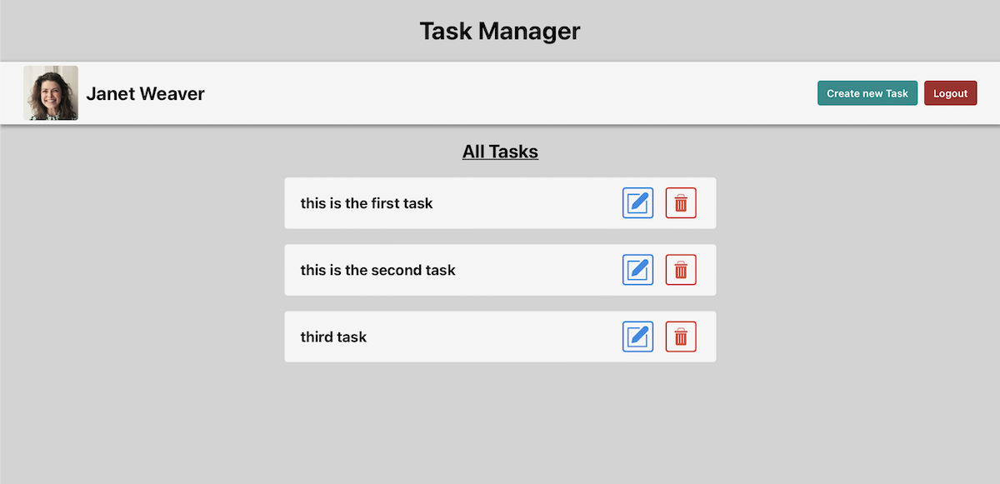

# **Task Manager**

This project was built in react to add, update and delete the tasks.

 

## **Features**

- **reqres.in** api is used to register/login the user.
- **axios** - used to make the requests to the api.

 

## **Steps**

### **Login**
- User is taken to the login page first, where user can login with any pre-specifed email address provided by the **reqres.in** api.

 

### **Dashboard**
- After successful login, user is taken to the dashboard where user can see the tasks and add the tasks.

 

### **Tash Section**
- Logged in user can add tasks
- User can update any added task, and can also delete the task permanently.

 

## **Deployed Link :**

 